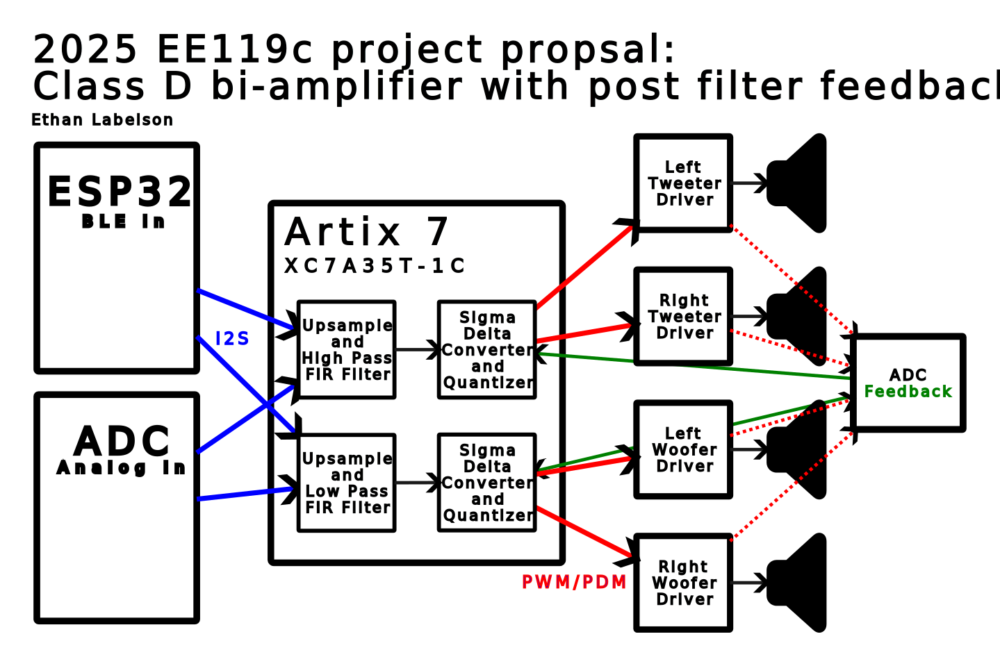

## Class D amplifier with post-filter feedback

Class D amplification has become the most prominent technology across modern audio amplifiers. Class D amps are able to achieve much higher efficiency due to switching the power stage fully on and off instead of operating the MOSFETs or BJTs as linear devices. However, class D amps are often known for being generally “lower quality” than their class AB counterparts. 

The most basic class D amplifiers use PWM and a low-pass filter to convert the audio signal from digital to analog. The width of the pulses sent to the power stage corresponds to the amplitude of the audio wave at a given time. If switched at a sufficiently high frequency, the carrier frequency of the PWM signal will be above the range of human hearing. However, high resolution, high frequency PWM quickly runs into limits based on the maximum clock frequency of current chips. In order to have n bits of PWM resolution, there must be a timer which counts to 2n within every PWM cycle. For example, audio commonly is stored with 16 bits of resolution at ~40 kHz (commonly 44.1 kHz but 40 is a kinder number). 40,000*216 = 2.6 GHz counter increment frequency, which pushes the limits of even high end FPGA chips. Additionally, 40 kHz is close enough to the audible range that some distortion may be audible. Most modern class D architectures have PWM frequencies of between 250 kHz and 1 MHz. 

In order to reach such high switching frequencies, the audio data must be downsampled or quantized. However, this downsampling of data introduces quantization noise, reducing the effective resolution of the audio signal. Distortion can be reduced by oversampling the audio, however there are limitations to how far this can increase effective resolution. Oversampling can also drive up clock rates which, as mentioned earlier, will constrain the max number of bits which can be used.

Delta-sigma modulation is a more robust oversampling method which can achieve better effective resolution than oversampling alone. Delta-sigma conversion takes the difference between the output of the audio conversion and the input, then integrates the result. Chaining multiple converters back to back (referred to a higher order delta-sigma converter) can further increase effective resolution. There are stability issues which arise from higher order sigma-delta modulators, however these issues can be mitigated by decreasing the gain on the feedback, or adding additional “feed-forward” signal paths bypassing some of the integrator stages.

Most delta-sigma converters take their feedback from the digital output of the conversion. However, this does not correct for any nonlinearities of the output stage or filter elements before the speaker. By sampling the feedback from an ADC after the LC output filter (directly before the signal reaches the speaker) any filter nonlinearities enclosed within the feedback loop, thereby (hopefully) correcting them and reducing the distortion of the amplifier.

For my project, I will be implementing a class D amplifier with a high order (n>=2) delta-sigma modulator which takes feedback from an external ADC. Audio input will be via I2S supplied by an ESP32 or external ADC. Both options will be included together on the PCB, as this gives the option for both analog and bluetooth audio inputs. There will be 4 output channels: R+L for both high frequency and low frequency drivers. I will utilize the Alchitry Au V2 dev board, containing an Xilinx XC7A35T. The XC7A35T has dedicated DSP slices which provide discrete hardware for large multiply and accumulate operations. I plan to utilize these for my upsampling and filtering of the audio input. The data flow is described in detail in the block diagram of the system.

**Technology:     Xilinx Artix 7 XC7A35T**

**Size Estimate:  ~15,000 slices**

## Block Diagram
